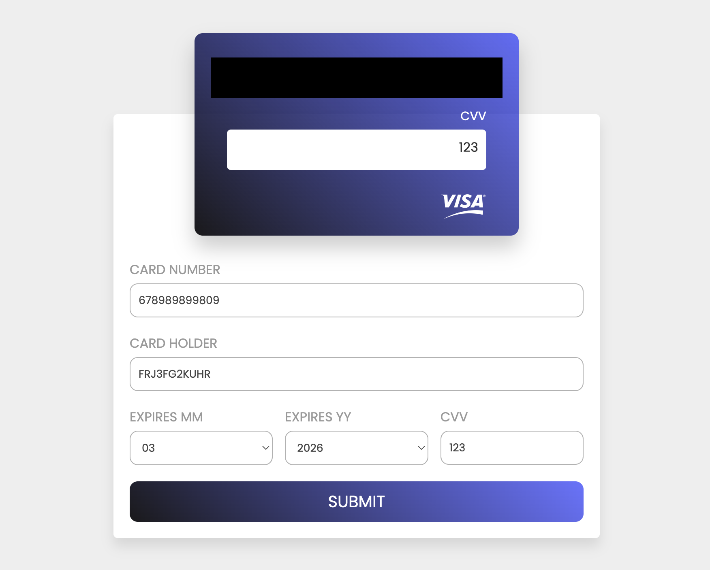

# Frontend Mentor - Interactive card details form solution

This is a solution to the [Interactive card details form challenge on Frontend Mentor](https://www.frontendmentor.io/challenges/interactive-card-details-form-XpS8cKZDWw). Frontend Mentor challenges help you improve your coding skills by building realistic projects. 

## Table of contents

- [Overview](#overview)
  - [Screenshot](#screenshot)
- [My process](#my-process)
  - [Built with](#built-with)
  - [What I learned](#what-i-learned)
  - [Continued development](#continued-development)
  - [Useful resources](#useful-resources)
- [Acknowledgments](#acknowledgments)

## Overview

### Screenshot

## My process

### Built with

- Semantic HTML5 markup
- Flexbox
- Javascript

### What I learned

- how to space numbers every four digits
- how to rotate an image around to the back
- how to add mouse event listeners
- css flexbox

### Continued development

Creating the error functions, and adding better place holders, and possibly adding cleave.js

### Useful resources

- [Youtube tutorial](https://www.youtube.com/watch?v=G7_VTWnWz40&t=992s) - This helped me a lot with the html and styling, so I could do the javascrpt on my own to pracice

## Acknowledgments

Thankyou to mr web design for inspiration and help
